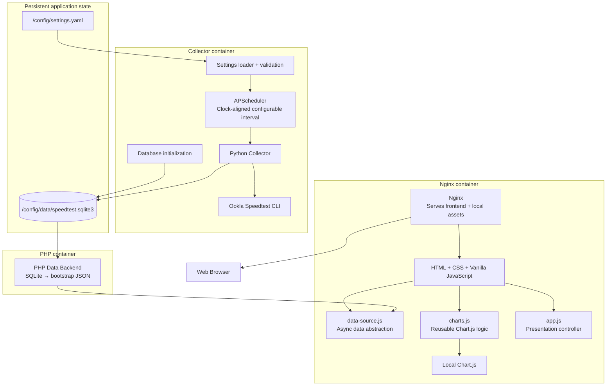
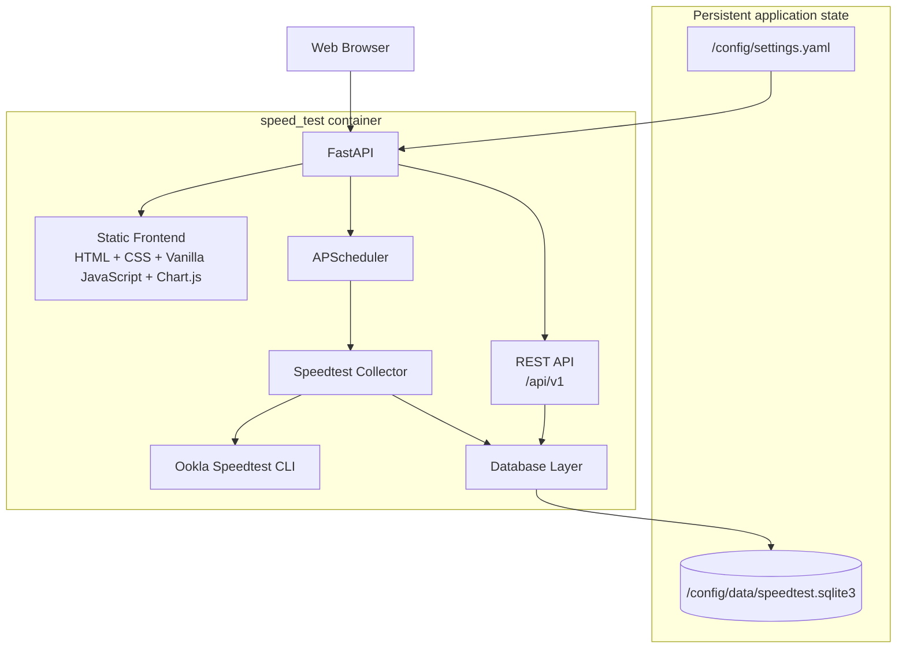

# speed_test

> [!IMPORTANT]
> Version 2 is currently under development on the `v2-development` branch.
>
> The latest stable release is **v1.0.0**.
>
> For the stable Version 1 implementation and installation instructions, use the [`v1.0.0`](../../releases/tag/v1.0.0) release/tag.

Self-hosted Docker application for continuously monitoring Internet connection performance using Ookla Speedtest CLI, SQLite, and a local web dashboard.

> **ToDo:** The screenshots below currently represent the Version 1 dashboard and will be replaced as the Version 2 interface is developed.

| | |
|---|---|
|  |  |
|  |  |


## Table of Contents

- [Features](#features)
- [Architecture](#architecture)
- [Supported Architectures](#supported-architectures)
- [Quick Start](#quick-start)
- [Application Setup](#application-setup)
- [Usage](#usage)
  - [Docker Compose](#docker-compose)
  - [Docker CLI](#docker-cli)
- [Configuration](#configuration)
  - [Configuration File](#configuration-file)
  - [Environment Variables](#environment-variables)
  - [Changing Parameters of a Running Container](#changing-parameters-of-a-running-container)
- [Deployment Considerations](#deployment-considerations)
  - [Data Volumes](#data-volumes)
  - [Ports](#ports)
- [Accessing the GUI](#accessing-the-gui)
- [Dashboard Visualization](#dashboard-visualization)
- [REST API](#rest-api)
- [Persistent Data](#persistent-data)
- [Backup and Restore](#backup-and-restore)
- [Migration from Version 1](#migration-from-version-1)
- [Shell Access](#shell-access)
- [Docker Image Versioning and Tags](#docker-image-versioning-and-tags)
- [Docker Image Update](#docker-image-update)
- [Building Locally](#building-locally)
- [Development](#development)
- [Versions](#versions)
   - [v1.0.0](#v100)
   - [v2.0.0-alpha.1](#v200-alpha1)
   - [v2.0.0-alpha.2](#v200-alpha2)
   - [v2.0.0-alpha.3](#v200-alpha3)
   - [v2.0.0-alpha.4](#v200-alpha4)
   - [v2.0.0](#v200)
- [Troubleshooting](#troubleshooting)
- [License](#license)
- [Third-party Software](#third-party-software)
- [Disclaimer](#disclaimer)
- [Support](#support)


## Features

Current functionality includes:

- Automated Internet connection performance measurements using Ookla Speedtest CLI.
- Download and upload speed monitoring.
- Ping and loaded latency measurements.
- Persistent historical storage using SQLite.
- Local web dashboard.
- Dockerized deployment.
- Internal Speedtest scheduling using APScheduler.
- Clock-aligned measurements with configurable scheduler intervals.
- Configurable scheduler timezone.
- Persistent collector container.
- Protection against overlapping Speedtest executions.
- Single persistent application-state volume at `/config`.
- Automatic creation of default settings and the SQLite database.
- Startup validation for scheduler settings.
- Preservation of existing user-provided settings and historical SQLite data.
- Local Chart.js visualization with no runtime CDN dependency.
- 24-hour, weekly, and monthly charts rendered from the existing PHP-generated datasets.
- Dashboard charts available over LAN even when WAN access is unavailable.
- Presentation layer separated into HTML, CSS, and Vanilla JavaScript.
- Reusable Chart.js logic in dedicated frontend modules.
- Responsive dashboard layout using CSS Grid and Flexbox.
- Responsive Chart.js canvases for desktop, tablet, and mobile widths.
- Asynchronous frontend data-source abstraction prepared for REST API consumption.
- Local favicon and application title for a complete browser experience.

> **ToDo:** Update this section as additional Version 2 functionality is implemented and validated.


## Architecture

Version 2 is being implemented incrementally. The current development milestone, `v2.0.0-alpha.4`, keeps the three-container runtime architecture while refactoring the presentation layer toward the final Version 2 frontend stack.

Current `v2.0.0-alpha.4` architecture:



Persistent application state:

```text
/config/
├── settings.yaml
├── data/
│   └── speedtest.sqlite3
└── logs/
```

Current internal collector layout:

```text
/app/
├── collector/
│   └── speedtest.py
├── config/
│   ├── settings.py
│   └── settings.default.yaml
├── database/
│   ├── database.py
│   └── schema.sql
└── bin/
    └── speedtest
```

Current frontend layout:

```text
/web_page/
├── index.php
├── database.php
├── stylesheet.css
├── assets/
│   └── favicon.svg
└── js/
    ├── app.js
    ├── charts.js
    ├── data-source.js
    └── vendor/
        ├── chart.umd.min.js
        └── README.md
```

Frontend responsibilities are now separated as follows:

```text
database.php
    ↓
bootstrap JSON
    ↓
data-source.js
    ↓
app.js
    ├── render latest measurement
    └── render charts
            ↓
        charts.js
            ↓
        Chart.js
```

The `data-source.js` interface is asynchronous even though Alpha 4 still receives data through the PHP-generated bootstrap payload. This intentionally prepares the frontend for Alpha 5, where the implementation can move to `fetch()` and the public REST API without rewriting the presentation layer.

The final target for Version 2 remains a single self-contained Docker application combining data collection, persistence, scheduling, visualization, and a public REST API.

Target Version 2 architecture:



> **ToDo:** Update this section as each architectural milestone replaces additional Version 1 components.


## Supported Architectures

> **ToDo:** Pending section; to be created/updated/removed as needed after validating the architectures supported by the final image and Ookla Speedtest CLI.


## Quick Start

> **ToDo:** Pending section; final Version 2 quick-start instructions will be added once the runtime architecture is available.

The intended final installation experience is:

```bash
docker compose up -d
```

The application is expected to expose its web interface on port `8080`.

```text
http://SERVER_IP:8080
```


## Application Setup

Version 2 development now initializes its persistent application state automatically.

On first startup, the collector:

1. Creates the `/config` directory structure when missing.
2. Creates `/config/settings.yaml` from the packaged defaults when missing.
3. Creates `/config/data/speedtest.sqlite3` using the current Version 1-compatible schema when missing.
4. Preserves existing user-provided settings and database files.
5. Validates scheduler settings before starting APScheduler.

Current persistent layout:

```text
/config/
├── settings.yaml
├── data/
│   └── speedtest.sqlite3
└── logs/
```

The `logs/` directory is reserved for future logging support. The collector does not write `collector.log` yet.


## Usage

> **ToDo:** Pending section; to be completed when the Version 2 container interface is finalized.


### Docker Compose

> **ToDo:** Final Docker Compose configuration will be added here.

```yaml
# TODO: Version 2 Docker Compose configuration
```


### Docker CLI

> **ToDo:** Final `docker run` example will be added here.

```bash
# TODO: Version 2 Docker CLI example
```

Docker Compose will be the recommended deployment method.


## Configuration

Application behavior is configured through:

```text
/config/settings.yaml
```


### Configuration File

The current default configuration is:

```yaml
scheduler:
  interval_minutes: 15
  timezone: UTC
```

`scheduler.interval_minutes` controls the clock-aligned Speedtest schedule.

Supported values are:

```text
1, 2, 3, 4, 5, 6, 10, 12, 15, 20, 30, 60
```

Only positive divisors of 60 are accepted so executions remain aligned to the clock.

Examples:

```text
5  → HH:00, HH:05, HH:10, ...
15 → HH:00, HH:15, HH:30, HH:45
30 → HH:00, HH:30
60 → HH:00
```

`scheduler.timezone` accepts a valid IANA timezone name, for example:

```yaml
scheduler:
  interval_minutes: 15
  timezone: America/Mexico_City
```

Invalid settings prevent the collector from starting and produce a configuration error in the container logs. Existing settings are never silently overwritten with defaults.


### Environment Variables

> **ToDo:** Pending section; document only environment variables that are actually required by the final container.

Environment variables should be reserved primarily for container/deployment-level settings. Application behavior should preferably be configured through `/config/settings.yaml`.


### Changing Parameters of a Running Container

Changes to `/config/settings.yaml` currently require a collector restart.

For example:

```bash
docker compose -f docker-compose-dev.yaml restart collector
```

The updated settings are validated and applied during startup.


## Deployment Considerations

> **ToDo:** Pending section; to be expanded once the final container architecture is available.


### Data Volumes

The application now uses `/config` as its persistent application-state volume.

Current layout:

```text
/config/
├── settings.yaml
├── data/
│   └── speedtest.sqlite3
└── logs/
```

The collector and PHP backend share the same persistent SQLite database at `/config/data/speedtest.sqlite3`.

> **ToDo:** Confirm final permissions and deployment examples before the stable Version 2 release.


### Ports

The intended default application port is:

| Port   | Purpose                    |
| ------ | -------------------------- |
| `8080` | Web dashboard and REST API |

> **ToDo:** Confirm final port configuration.


## Accessing the GUI

The intended default URL is:

```text
http://SERVER_IP:8080
```

> **ToDo:** Update this section when the Version 2 web interface becomes available.


## Dashboard Visualization

`v2.0.0-alpha.4` moves the dashboard presentation layer to the final Version 2 frontend stack:

```text
HTML
CSS
Vanilla JavaScript
Chart.js
```

The current dashboard provides:

- Latest download and upload measurements.
- Ping, download latency, and upload latency.
- Link to the corresponding Speedtest.net result when available.
- Last 24 hours, last week, and last month historical charts.
- Responsive layout for desktop, tablet, and mobile widths.
- Responsive Chart.js canvases.
- Local Chart.js runtime with no CDN dependency.
- Local favicon and browser title.

The frontend is split into dedicated modules:

```text
js/
├── app.js
├── charts.js
├── data-source.js
└── vendor/
    └── chart.umd.min.js
```

`data-source.js` already exposes an asynchronous data-loading interface. In Alpha 4 it reads the PHP-generated bootstrap payload; Alpha 5 will replace that implementation with REST API requests.

PHP remains responsible for database access until its data responsibilities are replaced by FastAPI.

> **ToDo:** Dynamic range selection, statistics, thresholds, incidents, and additional dashboard features will be introduced in later milestones.


## REST API

> **ToDo:** The Version 2 REST API is not implemented yet.

The REST API will serve as the public integration interface used both by the built-in frontend and by external applications.

The currently planned API namespace is:

```text
/api/v1
```

Planned endpoints include:

```text
GET  /api/v1/status
GET  /api/v1/results
GET  /api/v1/statistics
GET  /api/v1/config
GET  /health

POST /api/v1/tests/run
```

> **ToDo:** Replace this planned interface with the final validated API documentation and usage examples.


## Persistent Data

Version 2 keeps its current persistent application state under:

```text
/config
```

Current persistent files include:

```text
/config/settings.yaml
/config/data/speedtest.sqlite3
```

The `/config/logs/` directory is reserved for future application logs.

This allows configuration and historical data to remain accessible from the host for backup, monitoring, development, or external analysis.


## Backup and Restore

> **ToDo:** Pending section; final backup and restore procedures will be documented before the Version 2 stable release.

The intended design is for `/config` to contain everything required to preserve a deployment.


## Migration from Version 1

Version 2 is intended to preserve existing historical Version 1 data whenever reasonably possible.

> **ToDo:** Add the final `v1.0.0` → `v2.0.0` migration procedure after the Version 2 database schema and migration system are implemented.

During development, do not delete the original Version 1 SQLite database.


## Shell Access

> **ToDo:** Pending section; add shell access and diagnostic commands once the final image name and runtime structure are established.

Expected usage:

```bash
# TODO
docker exec -it speed-test /bin/sh
```


## Docker Image Versioning and Tags

This project follows Semantic Versioning.

Stable releases use:

```text
vMAJOR.MINOR.PATCH
```

Version 2 development milestones use prerelease identifiers:

```text
v2.0.0-alpha.1
v2.0.0-alpha.2
...
v2.0.0
```

Alpha versions represent functional development milestones but are not considered stable releases.

> **ToDo:** Document the final Docker Hub tag strategy before publishing Version 2.

Expected stable Docker image tags may include:

```text
latest
2
2.0
2.0.0
```


## Docker Image Update

> **ToDo:** Pending section; update instructions will be finalized when the Version 2 image is published.

Expected Docker Compose update procedure:

```bash
docker compose pull
docker compose up -d
```


## Building Locally

> **ToDo:** Pending section; update after the final Version 2 Dockerfile is available.

Expected development workflow:

```bash
git clone https://github.com/cristianCanek/speed_test.git
cd speed_test

docker build .
```


## Development

Version 2 is being developed incrementally on:

```text
v2-development
```

Development milestones are tagged as:

```text
v2.0.0-alpha.1
v2.0.0-alpha.2
...
```

The complete Version 2 development plan is documented in:

```text
ROADMAP.md
```

Stable releases are published from the default branch after validation.

Development builds should not be considered replacements for the latest stable release until `v2.0.0` is published.


## Versions

### v1.0.0

Initial stable release using the original multi-container architecture.

Version 1 uses:

- Python collector.
- Ookla Speedtest CLI.
- SQLite.
- PHP.
- Nginx.
- Google Charts.
- Host-based `crontab` scheduling.


### v2.0.0-alpha.1

First functional Version 2 development milestone.

Alpha 1 introduces:

- APScheduler-based internal scheduling.
- Clock-aligned Speedtests at HH:00, HH:15, HH:30 and HH:45.
- A persistent collector container.
- Cross-process protection against overlapping Speedtest executions.
- Removal of the host `crontab` dependency.
- Compatibility with the existing Version 1 SQLite schema and web dashboard.


### v2.0.0-alpha.2

Second functional Version 2 development milestone.

Alpha 2 introduces:

- `/config` as the persistent application-state volume.
- `/config/settings.yaml` with default scheduler settings.
- Configurable clock-aligned Speedtest intervals.
- Configurable IANA scheduler timezone.
- Automatic creation of the persistent directory structure.
- Automatic creation of the SQLite database when missing.
- Preservation of user-provided settings and existing historical databases.
- Startup validation with user-friendly configuration errors.
- Internal separation of collector, configuration, database, and bundled executable files.


### v2.0.0-alpha.3

Third functional Version 2 development milestone.

Alpha 3 introduces:

- Chart.js as the dashboard charting library.
- A locally bundled Chart.js runtime with no CDN dependency.
- Chart.js rendering for the existing 24-hour, weekly, and monthly historical datasets.
- PHP-generated JSON-compatible chart datasets.
- Local serving of frontend assets through Nginx.
- Offline/LAN-only dashboard visualization without WAN access.
- Chart scaling across the full available X-axis data range.


### v2.0.0-alpha.4

Fourth functional Version 2 development milestone.

Alpha 4 introduces:

- Presentation separated from PHP-generated markup.
- Semantic HTML dashboard structure.
- Responsive CSS using Grid and Flexbox.
- Reusable Chart.js logic in `js/charts.js`.
- Frontend presentation/controller logic in `js/app.js`.
- Asynchronous data-source abstraction in `js/data-source.js`.
- Responsive charts for desktop, tablet, and mobile layouts.
- A local SVG favicon and browser title.
- Frontend architecture prepared for REST API consumption in Alpha 5.

PHP remains temporarily responsible for reading SQLite and producing the bootstrap dataset.


### v2.0.0

> **ToDo:** Currently under development.

Version 2 will progressively replace the original architecture through the alpha milestones documented in `ROADMAP.md`.

Detailed implementation history is maintained in `CHANGELOG.md`.


## Troubleshooting

> **ToDo:** Pending section; common problems and diagnostic procedures will be added as Version 2 functionality becomes available.

Expected topics may include:

- Container fails to start.
- Configuration validation errors.
- Database initialization/migration failures.
- Ookla Speedtest CLI failures.
- Scheduler failures.
- Dashboard/API connectivity.
- Permissions on `/config`.
- Failed Internet speed tests.


## License

This project is licensed under the MIT License.

See [LICENSE](LICENSE) for details.


## Third-party Software

This project uses Ookla's Speedtest CLI to perform network speed measurements.
Ookla Speedtest CLI is distributed and licensed separately by Ookla.

Version 2 development also uses:

- APScheduler for internal Speedtest scheduling.
- PyYAML for YAML settings parsing.
- Chart.js for local dashboard visualization.

Chart.js is bundled locally with the project so dashboard charts do not require CDN or WAN access at runtime.

> **ToDo:** Add additional third-party runtime components and their licenses as Version 2 dependencies are finalized.


## Disclaimer

This project is provided for personal monitoring and informational purposes. Speed test results may vary depending on network conditions, test server selection, hardware, ISP behavior, and other factors. Results should not be considered a guaranteed measurement of service quality or availability.

This project is not affiliated with, endorsed by, or sponsored by Ookla. Speedtest® and Ookla® are trademarks of Ookla, LLC.


## Support

If this project is useful to you and you'd like to support its development:

[](https://ko-fi.com/cristiancampuzano)
[](https://paypal.me/cristianCanek)
