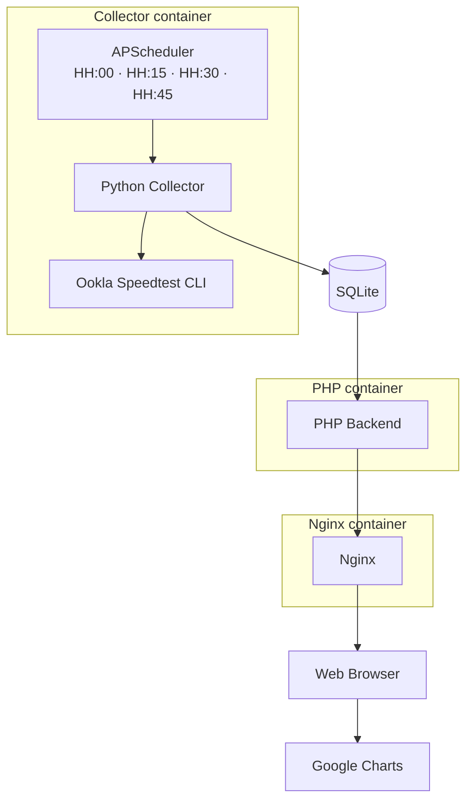
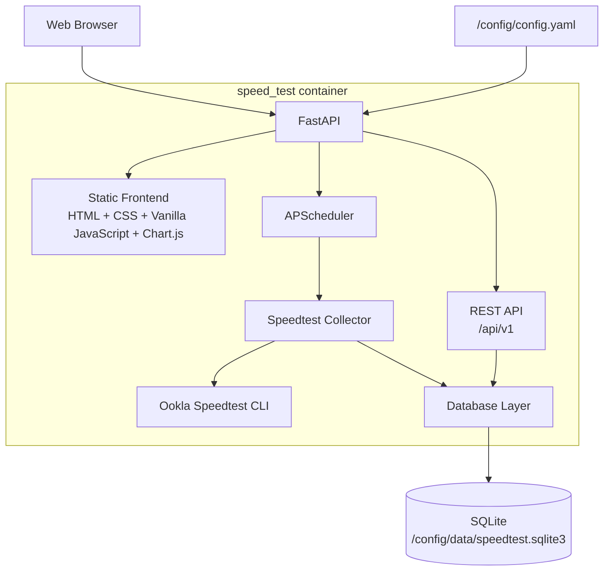

# speed_test

> [!IMPORTANT]
> Version 2 is currently under development on the `v2-development` branch.
>
> The latest stable release is **v1.0.0**.
>
> For the stable Version 1 implementation and installation instructions, use the [`v1.0.0`](../../releases/tag/v1.0.0) release/tag.

Self-hosted Docker application for continuously monitoring Internet connection performance using Ookla Speedtest CLI, SQLite, and a local web dashboard.

> **ToDo:** The screenshots below currently represent the Version 1 dashboard and will be replaced as the Version 2 interface is developed.

| | |
|---|---|
|  |  |
|  |  |


## Table of Contents

- [Features](#features)
- [Architecture](#architecture)
- [Supported Architectures](#supported-architectures)
- [Quick Start](#quick-start)
- [Application Setup](#application-setup)
- [Usage](#usage)
  - [Docker Compose](#docker-compose)
  - [Docker CLI](#docker-cli)
- [Configuration](#configuration)
  - [Configuration File](#configuration-file)
  - [Environment Variables](#environment-variables)
  - [Changing Parameters of a Running Container](#changing-parameters-of-a-running-container)
- [Deployment Considerations](#deployment-considerations)
  - [Data Volumes](#data-volumes)
  - [Ports](#ports)
- [Accessing the GUI](#accessing-the-gui)
- [REST API](#rest-api)
- [Persistent Data](#persistent-data)
- [Backup and Restore](#backup-and-restore)
- [Migration from Version 1](#migration-from-version-1)
- [Shell Access](#shell-access)
- [Docker Image Versioning and Tags](#docker-image-versioning-and-tags)
- [Docker Image Update](#docker-image-update)
- [Building Locally](#building-locally)
- [Development](#development)
- [Versions](#versions)
- [Troubleshooting](#troubleshooting)
- [License](#license)
- [Third-party Software](#third-party-software)
- [Disclaimer](#disclaimer)
- [Support](#support)


## Features

Current functionality includes:

- Automated Internet connection performance measurements using Ookla Speedtest CLI.
- Download and upload speed monitoring.
- Ping and loaded latency measurements.
- Persistent historical storage using SQLite.
- Local web dashboard.
- Dockerized deployment.
- Internal Speedtest scheduling using APScheduler.
- Clock-aligned measurements at HH:00, HH:15, HH:30 and HH:45.
- Persistent collector container.
- Protection against overlapping Speedtest executions.

> **ToDo:** Update this section as additional Version 2 functionality is implemented and validated.


## Architecture

Version 2 is being implemented incrementally. The first development milestone, `v2.0.0-alpha.1`, replaces host-based `crontab` scheduling with APScheduler while preserving the existing three-container web architecture and SQLite schema.

Current `v2.0.0-alpha.1` architecture:



The final target for Version 2 remains a single self-contained Docker application combining data collection, persistence, scheduling, visualization, and a public REST API.

Target Version 2 architecture:




> **ToDo:** Update this section as each architectural milestone replaces additional Version 1 components.


## Supported Architectures

> **ToDo:** Pending section; to be created/updated/removed as needed after validating the architectures supported by the final image and Ookla Speedtest CLI.


## Quick Start

> **ToDo:** Pending section; final Version 2 quick-start instructions will be added once the runtime architecture is available.

The intended final installation experience is:

```bash
docker compose up -d
```

The application is expected to expose its web interface on port `8080`.

```text
http://SERVER_IP:8080
```


## Application Setup

> **ToDo:** Pending section; to be completed when automatic configuration and database initialization are implemented.

Version 2 is intended to initialize its required configuration and SQLite database automatically when they do not already exist.


## Usage

> **ToDo:** Pending section; to be completed when the Version 2 container interface is finalized.


### Docker Compose

> **ToDo:** Final Docker Compose configuration will be added here.

```yaml
# TODO: Version 2 Docker Compose configuration
```


### Docker CLI

> **ToDo:** Final `docker run` example will be added here.

```bash
# TODO: Version 2 Docker CLI example
```

Docker Compose will be the recommended deployment method.


## Configuration

> **ToDo:** Pending section; configuration options will be documented as they are implemented.

Version 2 is expected to use a persistent configuration directory:

```text
/config
```


### Configuration File

Expected configuration file:

```text
/config/config.yaml
```

> **ToDo:** Add the complete configuration reference, default values, validation rules, and examples.

```yaml
# TODO: Final Version 2 configuration example
```


### Environment Variables

> **ToDo:** Pending section; document only environment variables that are actually required by the final container.

Environment variables should be reserved primarily for container/deployment-level settings. Application behavior should preferably be configured through `/config/config.yaml`.


### Changing Parameters of a Running Container

> **ToDo:** Pending section; document which settings require a container restart and which, if any, can be reloaded dynamically.


## Deployment Considerations

> **ToDo:** Pending section; to be expanded once the final container architecture is available.


### Data Volumes

The final application is expected to use a single persistent volume:

```text
/config
```

Expected layout:

```text
/config/
├── config.yaml
└── data/
    └── speedtest.sqlite3
```

> **ToDo:** Confirm final paths and permissions.


### Ports

The intended default application port is:

| Port   | Purpose                    |
| ------ | -------------------------- |
| `8080` | Web dashboard and REST API |

> **ToDo:** Confirm final port configuration.


## Accessing the GUI

The intended default URL is:

```text
http://SERVER_IP:8080
```

> **ToDo:** Update this section when the Version 2 web interface becomes available.


## REST API

> **ToDo:** The Version 2 REST API is not implemented yet.

The REST API will serve as the public integration interface used both by the built-in frontend and by external applications.

The currently planned API namespace is:

```text
/api/v1
```

Planned endpoints include:

```text
GET  /api/v1/status
GET  /api/v1/results
GET  /api/v1/statistics
GET  /api/v1/config
GET  /health

POST /api/v1/tests/run
```

> **ToDo:** Replace this planned interface with the final validated API documentation and usage examples.


## Persistent Data

Version 2 is intended to keep all persistent application data under:

```text
/config
```

Expected database location:

```text
/config/data/speedtest.sqlite3
```

This allows configuration and historical data to remain accessible from the host for backup, monitoring, development, or external analysis.

> **ToDo:** Confirm final persistence behavior and directory structure.


## Backup and Restore

> **ToDo:** Pending section; final backup and restore procedures will be documented before the Version 2 stable release.

The intended design is for `/config` to contain everything required to preserve a deployment.


## Migration from Version 1

Version 2 is intended to preserve existing historical Version 1 data whenever reasonably possible.

> **ToDo:** Add the final `v1.0.0` → `v2.0.0` migration procedure after the Version 2 database schema and migration system are implemented.

During development, do not delete the original Version 1 SQLite database.


## Shell Access

> **ToDo:** Pending section; add shell access and diagnostic commands once the final image name and runtime structure are established.

Expected usage:

```bash
# TODO
docker exec -it speed-test /bin/sh
```


## Docker Image Versioning and Tags

This project follows Semantic Versioning.

Stable releases use:

```text
vMAJOR.MINOR.PATCH
```

Version 2 development milestones use prerelease identifiers:

```text
v2.0.0-alpha.1
v2.0.0-alpha.2
...
v2.0.0
```

Alpha versions represent functional development milestones but are not considered stable releases.

> **ToDo:** Document the final Docker Hub tag strategy before publishing Version 2.

Expected stable Docker image tags may include:

```text
latest
2
2.0
2.0.0
```


## Docker Image Update

> **ToDo:** Pending section; update instructions will be finalized when the Version 2 image is published.

Expected Docker Compose update procedure:

```bash
docker compose pull
docker compose up -d
```


## Building Locally

> **ToDo:** Pending section; update after the final Version 2 Dockerfile is available.

Expected development workflow:

```bash
git clone https://github.com/cristianCanek/speed_test.git
cd speed_test

docker build .
```


## Development

Version 2 is being developed incrementally on:

```text
v2-development
```

Development milestones are tagged as:

```text
v2.0.0-alpha.1
v2.0.0-alpha.2
...
```

The complete Version 2 development plan is documented in:

```text
ROADMAP.md
```

Stable releases are published from the default branch after validation.

Development builds should not be considered replacements for the latest stable release until `v2.0.0` is published.


## Versions

### v1.0.0

Initial stable release using the original multi-container architecture.

Version 1 uses:

- Python collector.
- Ookla Speedtest CLI.
- SQLite.
- PHP.
- Nginx.
- Google Charts.
- Host-based `crontab` scheduling.


### v2.0.0-alpha.1

First functional Version 2 development milestone.

Alpha 1 introduces:

- APScheduler-based internal scheduling.
- Clock-aligned Speedtests at HH:00, HH:15, HH:30 and HH:45.
- A persistent collector container.
- Cross-process protection against overlapping Speedtest executions.
- Removal of the host `crontab` dependency.
- Compatibility with the existing Version 1 SQLite schema and web dashboard.

### v2.0.0

> **ToDo:** Currently under development.

Version 2 will progressively replace the original architecture through the alpha milestones documented in `ROADMAP.md`.

Detailed implementation history is maintained in `CHANGELOG.md`.


## Troubleshooting

> **ToDo:** Pending section; common problems and diagnostic procedures will be added as Version 2 functionality becomes available.

Expected topics may include:

- Container fails to start.
- Configuration validation errors.
- Database initialization/migration failures.
- Ookla Speedtest CLI failures.
- Scheduler failures.
- Dashboard/API connectivity.
- Permissions on `/config`.
- Failed Internet speed tests.


## License

This project is licensed under the MIT License.

See [LICENSE](LICENSE) for details.


## Third-party Software

This project uses Ookla's Speedtest CLI to perform network speed measurements.
Ookla Speedtest CLI is distributed and licensed separately by Ookla.

Version 2 development also uses APScheduler for internal Speedtest scheduling.

> **ToDo:** Add additional third-party runtime components and their licenses as Version 2 dependencies are finalized.


## Disclaimer

This project is provided for personal monitoring and informational purposes. Speed test results may vary depending on network conditions, test server selection, hardware, ISP behavior, and other factors. Results should not be considered a guaranteed measurement of service quality or availability.

This project is not affiliated with, endorsed by, or sponsored by Ookla. Speedtest® and Ookla® are trademarks of Ookla, LLC.


## Support

If this project is useful to you and you'd like to support its development:

[](https://ko-fi.com/cristiancampuzano)
[](https://paypal.me/cristianCanek)
