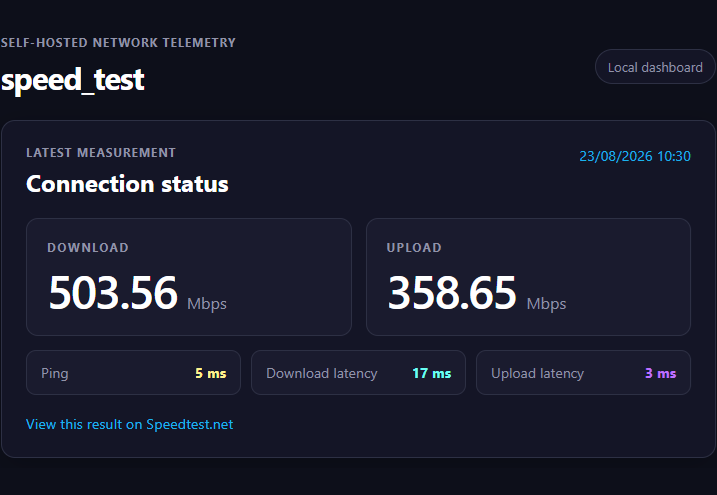
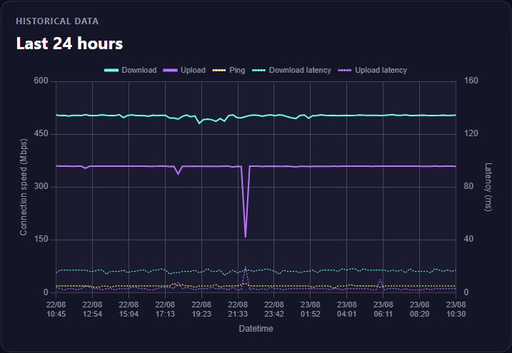
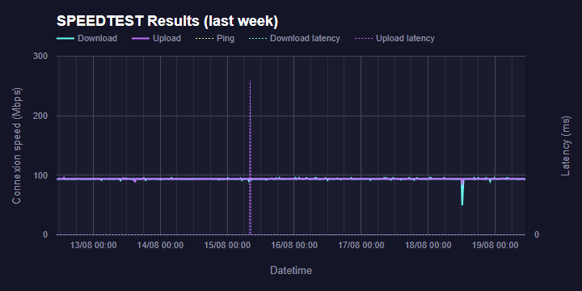
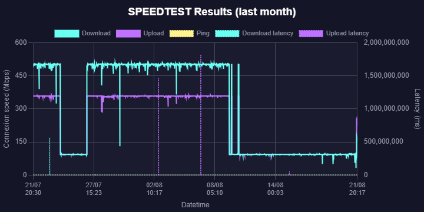
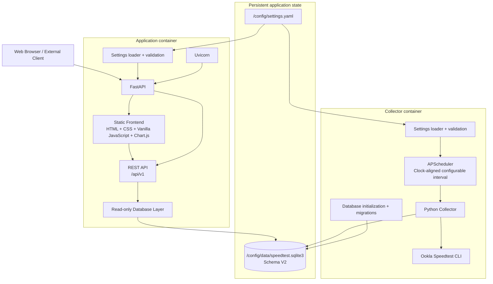
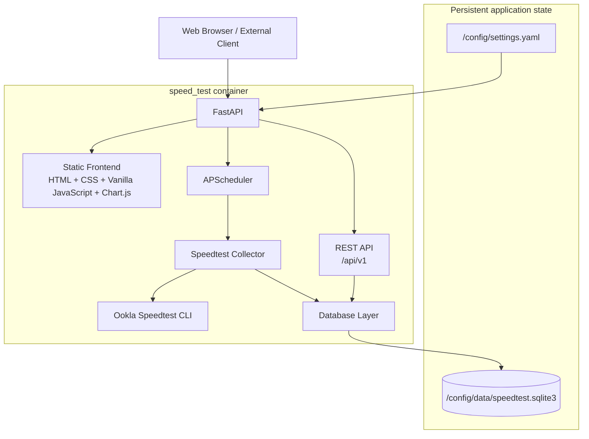

# speed_test

> [!IMPORTANT]
> Version 2 is currently under development on the `v2-development` branch.
>
> The latest stable release is **v1.0.0**.
>
> For the stable Version 1 implementation and installation instructions, use the [`v1.0.0`](../../releases/tag/v1.0.0) release/tag.

Self-hosted Docker application for continuously monitoring Internet connection performance using Ookla Speedtest CLI, SQLite, and a local web dashboard.

| | |
|---|---|
|  |  |
|  |  |


## Table of Contents

- [Features](#features)
- [Architecture](#architecture)
- [Supported Architectures](#supported-architectures)
- [Quick Start](#quick-start)
- [Application Setup](#application-setup)
- [Usage](#usage)
  - [Docker Compose](#docker-compose)
  - [Docker CLI](#docker-cli)
- [Configuration](#configuration)
  - [Configuration File](#configuration-file)
  - [Environment Variables](#environment-variables)
  - [Changing Parameters of a Running Container](#changing-parameters-of-a-running-container)
- [Deployment Considerations](#deployment-considerations)
  - [Data Volumes](#data-volumes)
  - [Ports](#ports)
- [Accessing the GUI](#accessing-the-gui)
- [Dashboard Visualization](#dashboard-visualization)
- [REST API](#rest-api)
- [Persistent Data](#persistent-data)
- [Backup and Restore](#backup-and-restore)
- [Migration from Version 1](#migration-from-version-1)
- [Shell Access](#shell-access)
- [Docker Image Versioning and Tags](#docker-image-versioning-and-tags)
- [Docker Image Update](#docker-image-update)
- [Building Locally](#building-locally)
- [Development](#development)
- [Versions](#versions)
   - [v1.0.0](#v100)
   - [v2.0.0-alpha.1](#v200-alpha1)
   - [v2.0.0-alpha.2](#v200-alpha2)
   - [v2.0.0-alpha.3](#v200-alpha3)
   - [v2.0.0-alpha.4](#v200-alpha4)
   - [v2.0.0-alpha.5](#v200-alpha5)
   - [v2.0.0-alpha.6](#v200-alpha6)
   - [v2.0.0](#v200)
- [Troubleshooting](#troubleshooting)
- [License](#license)
- [Third-party Software](#third-party-software)
- [Disclaimer](#disclaimer)
- [Support](#support)


## Features

Current functionality includes:

- Automated Internet connection performance measurements using Ookla Speedtest CLI.
- Download and upload speed monitoring.
- Ping and loaded latency measurements.
- Persistent historical storage using SQLite.
- Local web dashboard.
- Dockerized deployment.
- Internal Speedtest scheduling using APScheduler.
- Clock-aligned measurements with configurable scheduler intervals.
- Configurable scheduler timezone.
- Persistent collector container.
- Protection against overlapping Speedtest executions.
- Single persistent application-state volume at `/config`.
- Automatic creation of default settings and the SQLite database.
- Startup validation for scheduler settings.
- Preservation of existing user-provided settings and historical SQLite data.
- Local Chart.js visualization with no runtime CDN dependency.
- 24-hour, weekly, and monthly charts loaded through the public REST API.
- Dashboard charts available over LAN even when WAN access is unavailable.
- Presentation layer separated into HTML, CSS, and Vanilla JavaScript.
- Reusable Chart.js logic in dedicated frontend modules.
- Responsive dashboard layout using CSS Grid and Flexbox.
- Responsive Chart.js canvases for desktop, tablet, and mobile widths.
- Asynchronous frontend data-source abstraction prepared for REST API consumption.
- Local favicon and application title for a complete browser experience.
- FastAPI + Uvicorn application backend.
- Public versioned REST API under `/api/v1`.
- Static frontend served directly by FastAPI.
- Frontend data loaded through the same public REST API available to external integrations.
- Dynamic historical ranges such as `3h`, `24h`, `7d`, `14d`, `30d`, and `all`.
- Basic statistics endpoint for historical data.
- Application/database health endpoint.
- Interactive OpenAPI/Swagger documentation at `/docs`.
- Two-container runtime architecture: collector + application.
- Version 2 SQLite schema with explicit schema versioning.
- Automatic Version 1 → Version 2 database migration.
- Preservation of historical Version 1 measurements during migration.
- Normalized Version 2 column names and UTC timestamps.
- Indexed Version 2 result storage.
- Successful, failed, and missing execution states in persistent storage.
- Persistent error type, error message, and exit-code fields for failed executions.
- Statistics that distinguish successful, failed, and missing executions.
- Scheduler next-run timestamp exposed using the timezone configured in `settings.yaml`.
- Direct dashboard link to the interactive REST API documentation.

> **ToDo:** Update this section as additional Version 2 functionality is implemented and validated.


## Architecture

Version 2 is being implemented incrementally. The current development milestone, `v2.0.0-alpha.6`, keeps the two-container runtime introduced in Alpha 5 while replacing the legacy persistence model with the Version 2 database schema and migration system.

Current `v2.0.0-alpha.6` architecture:



Application containers: **2**

```text
collector
web_app
```

Persistent application state remains external to both containers:

```text
/config/
├── settings.yaml
├── data/
│   └── speedtest.sqlite3
└── logs/
```

Current internal database layout:

```text
/app/database/
├── database.py
├── queries.py
├── schema.sql
└── migrations/
    └── 001_v1_to_v2.sql
```

Current internal collector layout:

```text
/app/
├── collector/
│   └── speedtest.py
├── config/
│   ├── settings.py
│   └── settings.default.yaml
├── database/
│   ├── database.py
│   └── schema.sql
└── bin/
    └── speedtest
```

The frontend continues to follow the Version 2 architectural rule:

```text
Frontend
   │
   ▼
Public REST API
   │
   ▼
Database layer
   │
   ▼
SQLite
```

The Version 2 database schema is therefore hidden behind the public REST API. Alpha 6 changes the persistence implementation without requiring corresponding frontend data-model changes.

The collector owns database creation, schema migration, scheduled Speedtest execution, and database writes. The application container accesses the same SQLite database through a read-only query layer.

The final target for Version 2 remains a single self-contained Docker application combining data collection, persistence, scheduling, visualization, and the public REST API.

Target Version 2 architecture:



> **ToDo:** Update this section as each architectural milestone replaces additional Version 1 components.


## Supported Architectures

> **ToDo:** Pending section; to be created/updated/removed as needed after validating the architectures supported by the final image and Ookla Speedtest CLI.


## Quick Start

> **ToDo:** Pending section; final Version 2 quick-start instructions will be added once the runtime architecture is available.

The intended final installation experience is:

```bash
docker compose up -d
```

The application exposes its web interface internally on port `80` and can be mapped to any desired host port (`8000` by default).

```text
http://SERVER_IP:8000
```


## Application Setup

Version 2 development initializes and migrates persistent application state automatically.

On collector startup:

1. The `/config` directory structure is created when missing.
2. `/config/settings.yaml` is created from packaged defaults when missing.
3. If the database is missing, `/config/data/speedtest.sqlite3` is created directly using the Version 2 schema.
4. If a supported Version 1 database is detected, its historical data is migrated automatically to the Version 2 schema.
5. Existing user-provided settings and database files are preserved.
6. Scheduler settings are validated before APScheduler starts.
7. The database schema version is validated before scheduled collection begins.

Current persistent layout:

```text
/config/
├── settings.yaml
├── data/
│   └── speedtest.sqlite3
└── logs/
```

The `logs/` directory is reserved for Alpha 7 collector logging.

The Version 2 database includes a `schema_version` table so future schema migrations can be applied deterministically.


## Usage

> **ToDo:** Pending section; to be completed when the Version 2 container interface is finalized.


### Docker Compose

> **ToDo:** Final Docker Compose configuration will be added here.

```yaml
# TODO: Version 2 Docker Compose configuration
```


### Docker CLI

> **ToDo:** Final `docker run` example will be added here.

```bash
# TODO: Version 2 Docker CLI example
```

Docker Compose will be the recommended deployment method.


## Configuration

Application behavior is configured through:

```text
/config/settings.yaml
```


### Configuration File

The current default configuration is:

```yaml
scheduler:
  interval_minutes: 15
  timezone: UTC
```

`scheduler.interval_minutes` controls the clock-aligned Speedtest schedule.

Supported values are:

```text
1, 2, 3, 4, 5, 6, 10, 12, 15, 20, 30, 60
```

Only positive divisors of 60 are accepted so executions remain aligned to the clock.

Examples:

```text
5  → HH:00, HH:05, HH:10, ...
15 → HH:00, HH:15, HH:30, HH:45
30 → HH:00, HH:30
60 → HH:00
```

`scheduler.timezone` accepts a valid IANA timezone name, for example:

```yaml
scheduler:
  interval_minutes: 15
  timezone: America/Mexico_City
```

Invalid settings prevent the collector from starting and produce a configuration error in the container logs. Existing settings are never silently overwritten with defaults.


### Environment Variables

> **ToDo:** Pending section; document only environment variables that are actually required by the final container.

Environment variables should be reserved primarily for container/deployment-level settings. Application behavior should preferably be configured through `/config/settings.yaml`.


### Changing Parameters of a Running Container

Changes to `/config/settings.yaml` currently require a collector restart.

For example:

```bash
docker compose -f docker-compose-dev.yaml restart collector
```

The updated settings are validated and applied during startup.


## Deployment Considerations

> **ToDo:** Pending section; to be expanded once the final container architecture is available.


### Data Volumes

The application now uses `/config` as its persistent application-state volume.

Current layout:

```text
/config/
├── settings.yaml
├── data/
│   └── speedtest.sqlite3
└── logs/
```

The collector and FastAPI application share the same persistent SQLite database at `/config/data/speedtest.sqlite3`.
The collector writes measurements while the application accesses the database through a read-only query layer.

> **ToDo:** Confirm final permissions and deployment examples before the stable Version 2 release.


### Ports

The intended default application port is:

| Port | Purpose                    |
| ---- | -------------------------- |
| `80` | Web dashboard and REST API |

> **ToDo:** Confirm final port configuration.


## Accessing the GUI

The Alpha 5 development stack exposes the FastAPI application on:

```text
http://SERVER_IP:8000
```

For local development:

```text
http://localhost:8000
```

FastAPI serves the static dashboard directly; Nginx and PHP are no longer part of the active Alpha 5 runtime.


## Dashboard Visualization

The responsive dashboard introduced in Alpha 4 is preserved, but its data source has changed.

```text
Alpha 4:
PHP bootstrap payload
        ↓
data-source.js

Alpha 5:
Public REST API
        ↓
fetch()
        ↓
data-source.js
```

The dashboard continues to provide:

- Latest download and upload measurements.
- Ping, download latency, and upload latency.
- Speedtest.net result link when available.
- Last 24 hours, last week, and last month historical charts.
- Responsive layout for desktop, tablet, and mobile widths.
- Responsive Chart.js canvases.
- Local Chart.js runtime with no CDN dependency.
- Local favicon and browser title.

The frontend now consumes the same public REST API available to external integrations.

The dashboard's REST API status badge links directly to `/docs` and opens the interactive API documentation in a new browser tab. Because the link is relative, it automatically uses the same host and externally mapped port as the dashboard.


## REST API

`v2.0.0-alpha.5` introduced the first public Version 2 REST API. Alpha 6 preserves that contract while moving the API queries to the Version 2 database schema.

Base path:

```text
/api/v1
```

Interactive OpenAPI/Swagger documentation:

```text
/docs
```

OpenAPI schema:

```text
/openapi.json
```

Current endpoints:

| Method | Endpoint | Purpose |
| --- | --- | --- |
| `GET` | `/health` | Application/database health |
| `GET` | `/api/v1/status` | Current application, scheduler, and latest-result status |
| `GET` | `/api/v1/results?range=24h` | Historical Speedtest results |
| `GET` | `/api/v1/statistics?range=24h` | Basic statistics for a result range |
| `GET` | `/api/v1/config` | Public non-sensitive configuration |
| `POST` | `/api/v1/tests/run` | Reserved manual-test endpoint; returns `501` until Alpha 7 |

Dynamic result/statistics ranges accept:

```text
<number>h
<number>d
all
```

Examples:

```text
3h
24h
7d
14d
30d
365d
all
```

Invalid ranges return HTTP `400` with a human-readable error.

The current API reads the Version 2 SQLite schema through a dedicated read-only database layer.

`/api/v1/status` keeps stored measurement timestamps in UTC, while `scheduler.next_scheduled_boundary` is returned using the IANA timezone configured in `/config/settings.yaml`. This makes the next scheduled execution directly readable in the user's configured local timezone without changing the UTC storage policy. The frontend uses this same public API through `fetch()`; it does not access SQLite or private backend data paths directly.

`POST /api/v1/tests/run` intentionally exists as a reserved API contract but is not implemented yet. Manual execution will be implemented in Alpha 7 after the collector has been refactored into reusable application code.

> **Note:** `/docs` is the documentation URL. `/api/v1/docs` is not an API route. Likewise, opening `/api/v1/tests/run` directly in a browser performs a `GET`; the defined operation is `POST`.


## Persistent Data

Version 2 keeps its persistent application state under:

```text
/config
```

Current persistent files include:

```text
/config/settings.yaml
/config/data/speedtest.sqlite3
```

The SQLite database is currently at schema version **2**.

The primary Version 2 measurement table is:

```text
speedtest_runs
```

Each row represents an execution state rather than only a successful measurement:

```text
success
failed
missing
```

Successful rows contain Speedtest measurements. Failed rows can store error type, error message, and exit code. Missing rows represent expected executions for which no measurement was produced when the application can identify that condition.

Measurement timestamps and database metadata timestamps are stored consistently in UTC.

The `/config/logs/` directory is reserved for future application and collector logs.

Keeping configuration and historical data under `/config` allows the complete persistent state to be backed up independently from container images.


## Backup and Restore

> **ToDo:** Pending section; final backup and restore procedures will be documented before the Version 2 stable release.

The intended design is for `/config` to contain everything required to preserve a deployment.


## Migration from Version 1

Alpha 6 introduces the first automatic Version 1 → Version 2 database migration.

When the collector starts with an existing supported Version 1 database:

```text
Version 1 database
        │
        ▼
Legacy schema detected
        │
        ▼
001_v1_to_v2.sql
        │
        ▼
Version 2 schema
        │
        ├── schema_version
        └── speedtest_runs
```

Historical Version 1 rows are copied into `speedtest_runs` as successful executions and retain their original Version 1 row identifier in `legacy_raw_result_id`.

The legacy Version 1 tables/views are intentionally preserved during Alpha 6 as a migration safety net. All active Version 2 collector and REST API code uses the Version 2 schema after migration.

Migration validation was performed using a copy of the historical production database and confirmed that the migrated Version 2 historical-row count matched the Version 1 source count.

For development and migration testing, always use a backup or copy of important Version 1 data.

> **ToDo:** Add the final end-user migration and backup procedure before the stable `v2.0.0` release.


## Shell Access

> **ToDo:** Pending section; add shell access and diagnostic commands once the final image name and runtime structure are established.

Expected usage:

```bash
# TODO
docker exec -it speed-test /bin/sh
```


## Docker Image Versioning and Tags

This project follows Semantic Versioning.

Stable releases use:

```text
vMAJOR.MINOR.PATCH
```

Version 2 development milestones use prerelease identifiers:

```text
v2.0.0-alpha.1
v2.0.0-alpha.2
...
v2.0.0
```

Alpha versions represent functional development milestones but are not considered stable releases.

> **ToDo:** Document the final Docker Hub tag strategy before publishing Version 2.

Expected stable Docker image tags may include:

```text
latest
2
2.0
2.0.0
```


## Docker Image Update

> **ToDo:** Pending section; update instructions will be finalized when the Version 2 image is published.

Expected Docker Compose update procedure:

```bash
docker compose pull
docker compose up -d
```


## Building Locally

> **ToDo:** Pending section; update after the final Version 2 Dockerfile is available.

Expected development workflow:

```bash
git clone https://github.com/cristianCanek/speed_test.git
cd speed_test

docker build .
```


## Development

Version 2 is being developed incrementally on:

```text
v2-development
```

Development milestones are tagged as:

```text
v2.0.0-alpha.1
v2.0.0-alpha.2
...
```

The complete Version 2 development plan is documented in:

```text
ROADMAP.md
```

Stable releases are published from the default branch after validation.

Development builds should not be considered replacements for the latest stable release until `v2.0.0` is published.


## Versions

### v1.0.0

Initial stable release using the original multi-container architecture.

Version 1 uses:

- Python collector.
- Ookla Speedtest CLI.
- SQLite.
- PHP.
- Nginx.
- Google Charts.
- Host-based `crontab` scheduling.


### v2.0.0-alpha.1

First functional Version 2 development milestone.

Alpha 1 introduces:

- APScheduler-based internal scheduling.
- Clock-aligned Speedtests at HH:00, HH:15, HH:30 and HH:45.
- A persistent collector container.
- Cross-process protection against overlapping Speedtest executions.
- Removal of the host `crontab` dependency.
- Compatibility with the existing Version 1 SQLite schema and web dashboard.


### v2.0.0-alpha.2

Second functional Version 2 development milestone.

Alpha 2 introduces:

- `/config` as the persistent application-state volume.
- `/config/settings.yaml` with default scheduler settings.
- Configurable clock-aligned Speedtest intervals.
- Configurable IANA scheduler timezone.
- Automatic creation of the persistent directory structure.
- Automatic creation of the SQLite database when missing.
- Preservation of user-provided settings and existing historical databases.
- Startup validation with user-friendly configuration errors.
- Internal separation of collector, configuration, database, and bundled executable files.


### v2.0.0-alpha.3

Third functional Version 2 development milestone.

Alpha 3 introduces:

- Chart.js as the dashboard charting library.
- A locally bundled Chart.js runtime with no CDN dependency.
- Chart.js rendering for the existing 24-hour, weekly, and monthly historical datasets.
- PHP-generated JSON-compatible chart datasets.
- Local serving of frontend assets through Nginx.
- Offline/LAN-only dashboard visualization without WAN access.
- Chart scaling across the full available X-axis data range.


### v2.0.0-alpha.4

Fourth functional Version 2 development milestone.

Alpha 4 introduces:

- Presentation separated from PHP-generated markup.
- Semantic HTML dashboard structure.
- Responsive CSS using Grid and Flexbox.
- Reusable Chart.js logic in `js/charts.js`.
- Frontend presentation/controller logic in `js/app.js`.
- Asynchronous data-source abstraction in `js/data-source.js`.
- Responsive charts for desktop, tablet, and mobile layouts.
- A local SVG favicon and browser title.
- Frontend architecture prepared for REST API consumption in Alpha 5.

PHP remains temporarily responsible for reading SQLite and producing the bootstrap dataset.


### v2.0.0-alpha.5

Fifth functional Version 2 development milestone.

Alpha 5 introduces:

- FastAPI + Uvicorn as the Version 2 application backend.
- Public API versioning under `/api/v1`.
- Static frontend serving directly from FastAPI.
- Frontend data loading through the public REST API.
- Dynamic historical result ranges.
- Basic historical statistics.
- Application/database health endpoint.
- Interactive OpenAPI/Swagger documentation at `/docs`.
- Read-only application database query layer.
- Removal of PHP and Nginx from the active runtime.
- Reduction from three application containers to two.

The manual Speedtest endpoint is reserved as `POST /api/v1/tests/run` and intentionally returns HTTP `501` until the collector refactor in Alpha 7.


### v2.0.0-alpha.6

Sixth functional Version 2 development milestone.

Alpha 6 introduces:

- Version 2 SQLite schema.
- Explicit `schema_version` tracking.
- Automatic database creation directly at schema version 2.
- Automatic Version 1 → Version 2 database migration.
- Preservation of historical Version 1 measurements.
- Normalized column names and explicit units.
- Consistent UTC timestamp storage.
- Indexes for timestamp/status/result queries.
- Persistent `success`, `failed`, and `missing` execution states.
- Persistent error information for failed executions.
- Collector inserts updated for the Version 2 schema.
- REST API and statistics queries updated for the Version 2 schema.
- Statistics counts for successful, failed, and missing executions.
- Scheduler next-run time presented using the configured IANA timezone.
- Direct dashboard link to the Swagger/OpenAPI documentation.

The frontend continues to consume the same `/api/v1` contract and requires no database-specific implementation knowledge.


### v2.0.0

> **ToDo:** Currently under development.

Version 2 will progressively replace the original architecture through the alpha milestones documented in `ROADMAP.md`.

Detailed implementation history is maintained in `CHANGELOG.md`.


## Troubleshooting

> **ToDo:** Pending section; common problems and diagnostic procedures will be added as Version 2 functionality becomes available.

Expected topics may include:

- Container fails to start.
- Configuration validation errors.
- Database initialization/migration failures.
- Ookla Speedtest CLI failures.
- Scheduler failures.
- Dashboard/API connectivity.
- Permissions on `/config`.
- Failed Internet speed tests.


## License

This project is licensed under the MIT License.

See [LICENSE](LICENSE) for details.


## Third-party Software

This project uses Ookla's Speedtest CLI to perform network speed measurements.
Ookla Speedtest CLI is distributed and licensed separately by Ookla.

Version 2 development also uses:

- APScheduler for internal Speedtest scheduling.
- PyYAML for YAML settings parsing.
- Chart.js for local dashboard visualization.
- FastAPI for the Version 2 web application and REST API.
- Uvicorn as the ASGI server for FastAPI.

Chart.js is bundled locally with the project so dashboard charts do not require CDN or WAN access at runtime.

> **ToDo:** Add additional third-party runtime components and their licenses as Version 2 dependencies are finalized.


## Disclaimer

This project is provided for personal monitoring and informational purposes. Speed test results may vary depending on network conditions, test server selection, hardware, ISP behavior, and other factors. Results should not be considered a guaranteed measurement of service quality or availability.

This project is not affiliated with, endorsed by, or sponsored by Ookla. Speedtest® and Ookla® are trademarks of Ookla, LLC.


## Support

If this project is useful to you and you'd like to support its development:

[](https://ko-fi.com/cristiancampuzano)
[](https://paypal.me/cristianCanek)
