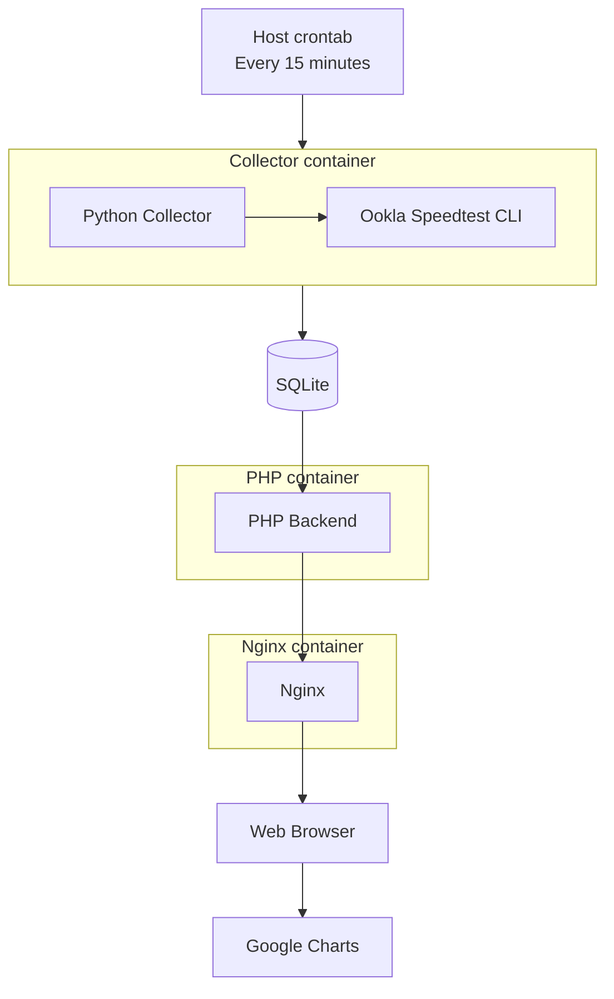
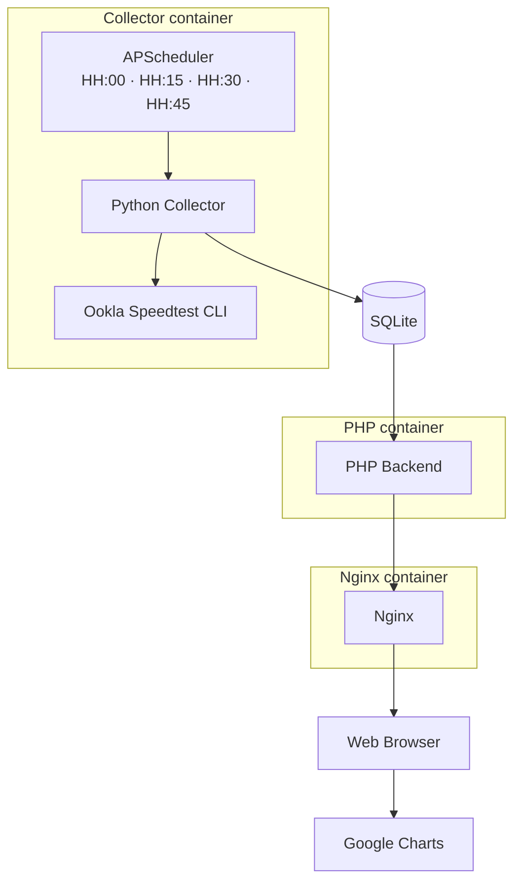
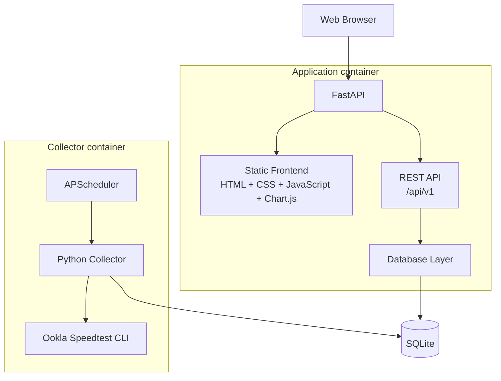
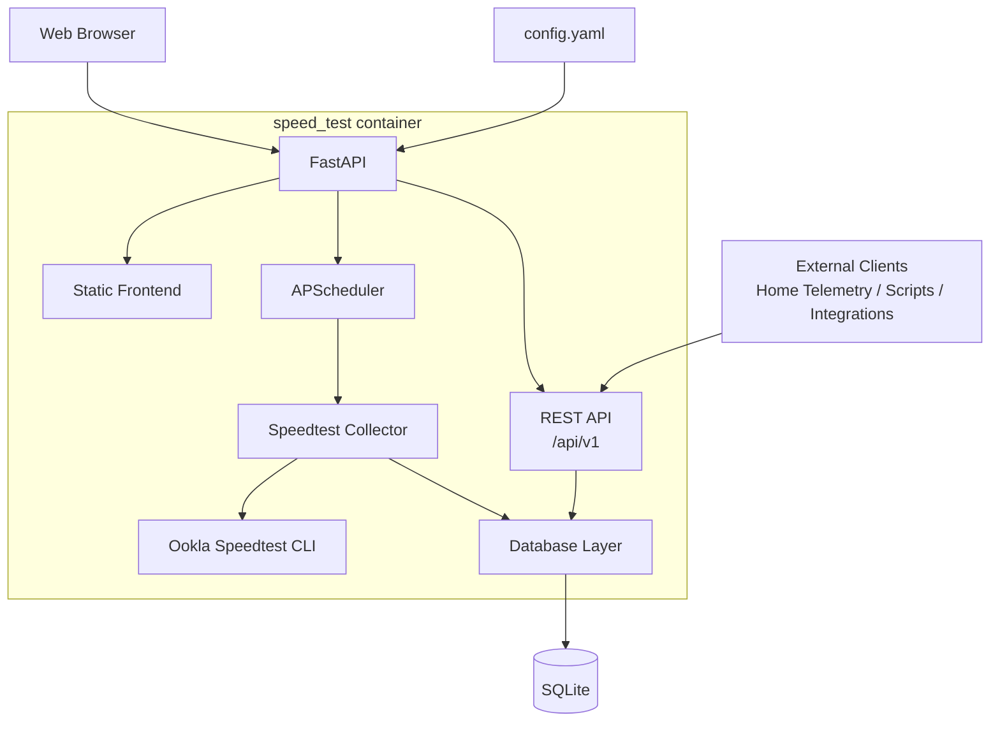

# speed_test — Version 2 Roadmap

Version 2 is a progressive refactor of the original `speed_test` architecture.

The objective is to evolve the project from its Version 1 multi-container implementation into a small, self-contained, configurable and integration-friendly application while preserving existing functionality and historical data whenever possible.


## Development principles

- Every alpha milestone must remain functional.
- The migration will be incremental rather than a complete rewrite.
- The evolution from three application containers to a single container should remain visible throughout the Git history.
- Existing historical SQLite data should remain compatible whenever reasonably possible.
- Stable Version 1 remains available through the `v1.0.0` tag and Version 1 Docker images.
- Version 2 development takes place on the `v2-development` branch.
- Alpha milestones may be tagged for traceability without being published as stable GitHub releases.
- `v2.0.0` will be published only after the complete architecture has been validated.


## Version 1 baseline

### v1.0.0 — Initial stable release

Original architecture:



Application containers: 3

- Collector
- PHP
- Nginx


# Version 2 development


## v2.0.0-alpha.1 — Internal scheduler

**Status:** ✅ Completed

### Goal

Remove the dependency on the host system's `crontab` and move test scheduling inside the collector.


### Completed work

- Introduced APScheduler.
- Scheduled tests at HH:00, HH:15, HH:30 and HH:45.
- Preserved the current SQLite schema.
- Preserved the existing collector behavior.
- Changed the collector from an ephemeral container to a persistent service.
- Added protection against overlapping Speedtest executions.
- Defined scheduler startup and shutdown behavior.
- Preserved the existing PHP/Nginx web functionality.
- Removed the host `crontab` dependency.


### Architecture milestone



Application containers: 3

External host `cron` dependency: Removed


## v2.0.0-alpha.2 — Persistent configuration

### Goal

Introduce a single persistent configuration location and make initial setup automatic.


### Planned work

- Introduce `/config` as the persistent volume.
- Move the database to: `/config/data/speedtest.sqlite3`
- Introduce: `/config/config.yaml`
- Create default configuration automatically when missing.
- Create the SQLite database automatically when missing.
- Preserve user-provided configuration and database files.
- Move APScheduler timing configuration into settings.
- Define default values.
- Validate configuration on startup.


### Target persistent layout

```text
/config/
├── config.yaml
└── data/
    └── speedtest.sqlite3
```


## v2.0.0-alpha.3 — Offline Chart.js visualization

### Goal

Remove the frontend dependency on Google Charts while keeping the existing datasets and backend behavior.


### Planned work

- Replace Google Charts with Chart.js.
- Bundle Chart.js locally.
- Keep current historical datasets initially.
- Preserve current PHP-generated data.
- Verify existing 24-hour, weekly and monthly views.
- Ensure charts work without WAN access.
- Remove all external chart/CDN dependencies.


### Required validation

```text
WAN disconnected
      │
      ▼
Dashboard opened through LAN
      │
      ▼
Charts render correctly
```


## v2.0.0-alpha.4 — Frontend refactor

### Goal

Move the presentation layer toward the final Version 2 frontend stack.


### Target stack

```text
HTML
CSS
Vanilla JavaScript
Chart.js
```


### Planned work

- Separate presentation from PHP-generated markup.
- Introduce reusable JavaScript chart logic.
- Introduce responsive CSS.
- Use CSS Grid and Flexbox.
- Prepare asynchronous dataset loading.
- Prepare the frontend for REST API consumption.
- Preserve all existing visualization functionality.

PHP must not be removed until its data responsibilities have been replaced.


## v2.0.0-alpha.5 — FastAPI and REST API

### Goal

Introduce the Version 2 application backend and replace PHP/Nginx responsibilities where possible.


### Planned technology

```text
Python
FastAPI
Uvicorn
```


### Initial public API

```text
GET  /api/v1/status
GET  /api/v1/results?range=24h
GET  /api/v1/statistics?range=24h
GET  /api/v1/config
GET  /health

POST /api/v1/tests/run
```


### Planned work

- Introduce FastAPI.
- Introduce API versioning under `/api/v1`.
- Serve the static frontend from FastAPI.
- Make the frontend consume the public REST API.
- Introduce dynamic dataset ranges.
- Implement basic application health endpoint.
- Remove PHP once all data responsibilities are replaced.
- Remove Nginx once FastAPI serves the frontend directly.


### Architectural rule

The frontend must consume the same public REST API available to external integrations.

```text
Frontend
   │
   ▼
REST API
   │
   ▼
Database layer
   │
   ▼
SQLite
```


### Expected architecture



Application containers: 2


## v2.0.0-alpha.6 — Database V2

### Goal

Refactor the persistence model after the REST API has isolated the frontend from SQLite implementation details.


### Planned work

- Define Version 2 schema.
- Introduce `schema_version`.
- Introduce database migrations.
- Preserve historical Version 1 data.
- Normalize column names.
- Normalize timestamps.
- Store timestamps consistently.
- Add appropriate indexes.
- Store failed Speedtest executions.
- Store error information.
- Distinguish successful, failed and missing measurements where appropriate.
- Update collector inserts.
- Update REST API queries.
- Update statistics queries.
- Validate migration using a copy of the historical Version 1 database.


### Architectural objective

Frontend changes should be minimal because database implementation remains hidden behind the REST API.


## v2.0.0-alpha.7 — Collector refactor

### Goal

Transform the existing collector into reusable application code ready to be integrated into the final container.


### Planned work

Separate responsibilities for:

```text
Ookla CLI execution
        │
        ▼
Result parsing
        │
        ▼
Domain model
        │
        ▼
Database repository
```

- Refactor current collector code.
- Add timeout handling.
- Validate Ookla JSON output.
- Handle exit codes.
- Handle malformed output.
- Record failed executions.
- Add manual execution entry point.
- Provide manual Speedtest execution from the running container through docker exec.
- Support saved and non-persistent manual tests.
- Support raw JSON output for manual tests.
- Reuse the same collector from APScheduler and REST manual execution.
- Prepare collector for integration with FastAPI lifecycle.


## v2.0.0-alpha.8 — Single-container architecture

### Goal

Merge the application and collector into the final Version 2 runtime architecture.


### Planned work

- Integrate APScheduler with application lifecycle.
- Integrate collector into the application container.
- Remove the standalone collector container.
- Use a common configuration layer.
- Use a common database layer.
- Expose only the web application port.
- Retain `/config` as the only persistent volume.


### Target architecture



Application containers: 1


## v2.0.0-alpha.9 — Production hardening and UI polish

### Goal

Prepare the new architecture for a stable public release.


### Configuration

- User-configurable Speedtest interval.
- Expected download speed.
- Expected upload speed.
- Warning thresholds.
- Critical thresholds.
- Ping thresholds.
- Timezone configuration.
- Dashboard defaults.


### Observability

- Application logging.
- Collector logging.
- Scheduler status.
- Last execution.
- Next execution.
- Failed execution reporting.
- Docker healthcheck.
- Distinguish application health from Internet health.


### Dashboard

- Responsive layout.
- KPI cards.
- Download/upload graph.
- Latency graph.
- Time-range selector.
- Statistics.
- Threshold visualization.
- Failed-test visualization.
- Incident list.
- Mobile/tablet/desktop layouts.
- UI polish.


### REST API

- Input validation.
- Consistent error responses.
- OpenAPI documentation review.
- Response model cleanup.
- Range validation.


### Docker

- Final Dockerfile.
- OCI image labels.
- `/config` permissions.
- Image size review.
- Non-root execution if practical.
- Final Compose example.


### Quality

- Unit tests.
- API tests.
- Migration tests.
- Historical database validation.
- Offline UI test.
- Restart/persistence test.
- Documentation review.
- Backup/restore documentation.
- V1 → V2 migration documentation.
- Final `README.md`.
- Final `CHANGELOG.md`.


# v2.0.0 — Stable release

Version `v2.0.0` should introduce little or no new functionality beyond the final alpha.

Expected transition:

```text
v2.0.0-alpha.9
        │
        ▼
Final testing
Documentation
Bug fixes
Release validation
        │
        ▼
v2.0.0
```


### Release criteria

A new user must be able to:

1. Create a directory.
2. Create or copy `compose.yaml`.
3. Run: `docker compose up -d`
4. Open: `http://SERVER_IP:8080`
5. Have default configuration generated automatically.
6. Have the SQLite database generated automatically.
7. Begin collecting Speedtest measurements automatically.
8. Retain data across container recreation and updates.
9. Use the dashboard without Internet access.
10. Configure connection speed and thresholds through `/config`.
11. Query data through the public REST API.
12. Execute a manual Speedtest through the API/UI.
13. See failed connection tests represented correctly.
14. See the container reported as healthy.
15. Upgrade without destroying historical data.


# Future development

Potential future work will be evaluated after Version 2 is stable.

Possible areas include:

- Optional MQTT publishing/integration.
- Additional statistics.
- Additional visualization types.
- External telemetry integration.
- Notification mechanisms.
- Further API capabilities.

MQTT is intentionally not assigned to a specific release until its value and integration model have been validated.
