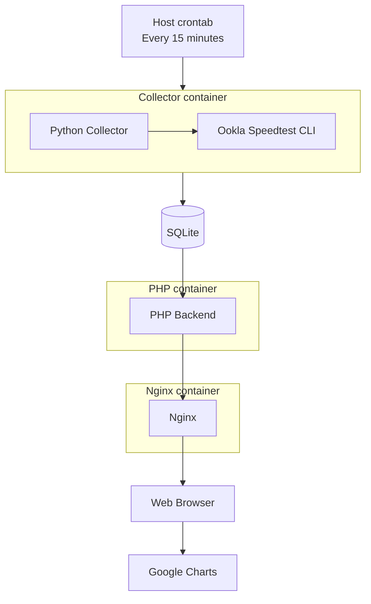
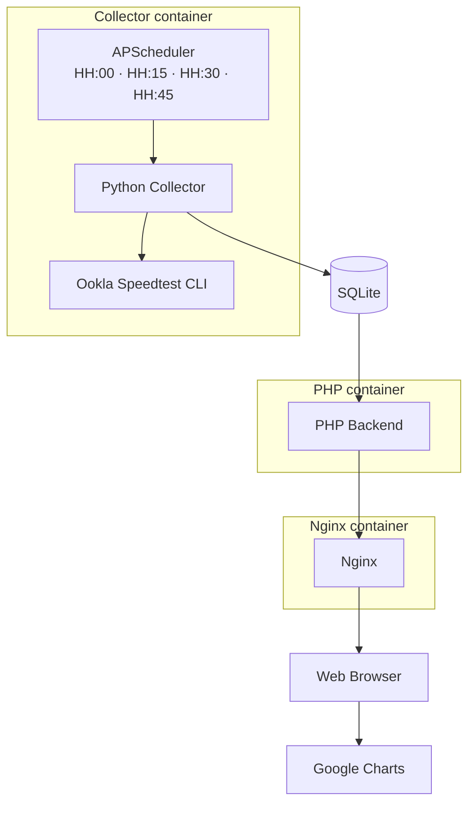
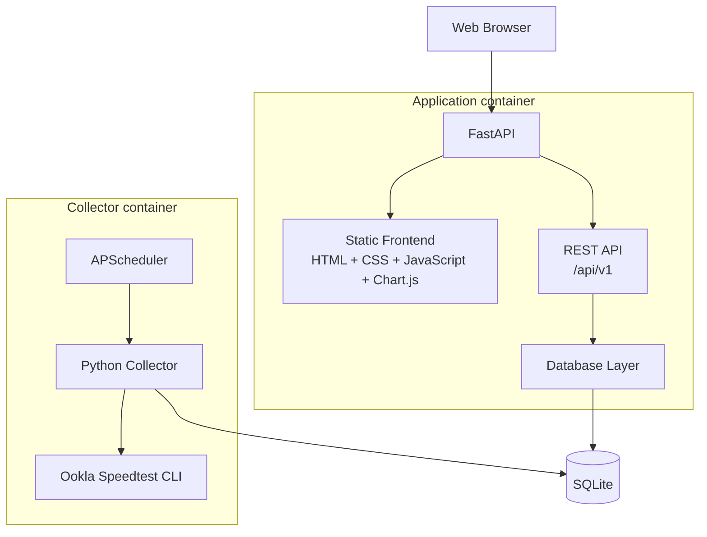

# speed_test — Version 2 Roadmap

Version 2 is a progressive refactor of the original `speed_test` architecture.

The objective is to evolve the project from its Version 1 multi-container implementation into a small, self-contained, configurable and integration-friendly application while preserving existing functionality and historical data whenever possible.


## Development principles

- Every alpha milestone must remain functional.
- The migration will be incremental rather than a complete rewrite.
- The evolution from three application containers to a single container should remain visible throughout the Git history.
- Existing historical SQLite data should remain compatible whenever reasonably possible.
- Stable Version 1 remains available through the `v1.0.0` tag and Version 1 Docker images.
- Version 2 development takes place on the `v2-development` branch.
- Alpha milestones may be tagged for traceability without being published as stable GitHub releases.
- `v2.0.0` will be published only after the complete architecture has been validated.


## Version 1 baseline

### v1.0.0 — Initial stable release

Original architecture:



Application containers: 3

- Collector
- PHP
- Nginx


# Version 2 development

```mermaid
flowchart LR
    V1["v1.0.0<br/>3 containers<br/>Host cron<br/>Google Charts"]
    A1["alpha.1 ✓<br/>3 containers<br/>APScheduler"]
    A2["alpha.2 ✓<br/>3 containers<br/>Persistent /config"]
    A3["alpha.3 ✓<br/>3 containers<br/>Chart.js"]
    A4["alpha.4 ✓<br/>3 containers<br/>Frontend refactor"]
    A5["alpha.5 ✓<br/>2 containers<br/>FastAPI + REST API"]
    A6["alpha.6 ✓<br/>2 containers<br/>Database V2"]
    A7["alpha.7<br/>2 containers<br/>Collector refactor"]
    A8["alpha.8<br/>1 container<br/>Unified architecture"]
    A9["alpha.9<br/>1 container<br/>Hardening + UI"]
    V2["v2.0.0<br/>Stable release"]

    V1 --> A1 --> A2 --> A3 --> A4 --> A5 --> A6 --> A7 --> A8 --> A9 --> V2
```




## v2.0.0-alpha.1 — Internal scheduler

**Status:** ✅ Completed

### Goal

Remove the dependency on the host system's `crontab` and move test scheduling inside the collector.


### Completed work

- Introduced APScheduler.
- Scheduled tests at HH:00, HH:15, HH:30 and HH:45.
- Preserved the current SQLite schema.
- Preserved the existing collector behavior.
- Changed the collector from an ephemeral container to a persistent service.
- Added protection against overlapping Speedtest executions.
- Defined scheduler startup and shutdown behavior.
- Preserved the existing PHP/Nginx web functionality.
- Removed the host `crontab` dependency.


### Architecture milestone



Application containers: 3

External host `cron` dependency: Removed


## v2.0.0-alpha.2 — Persistent configuration

**Status:** ✅ Completed

### Goal

Introduce a single persistent application-state location and make initial setup automatic.


### Completed work

- Introduced `/config` as the persistent application-state volume.
- Moved the database to `/config/data/speedtest.sqlite3`.
- Introduced `/config/settings.yaml`.
- Reserved `/config/logs/` for future collector logging.
- Created the required `/config` directory structure automatically when missing.
- Created default settings automatically when missing.
- Created the current Version 1-compatible SQLite database automatically when missing.
- Preserved user-provided settings and existing database files.
- Moved APScheduler interval and timezone configuration into settings.
- Defined and documented default scheduler values.
- Kept executions aligned to the clock for every supported interval.
- Validated scheduler settings on startup.
- Added user-friendly configuration errors for invalid intervals, invalid types, malformed YAML, and invalid timezones.
- Added internal modules for configuration and database initialization.
- Moved the bundled Ookla executable to `/app/bin/speedtest`.


### Target persistent layout

```text
/config/
├── settings.yaml
├── data/
│   └── speedtest.sqlite3
└── logs/
```


### Target internal filesystem

```text
/app/
├── collector/
│   └── speedtest.py
├── config/
│   ├── settings.py
│   └── settings.default.yaml
├── database/
│   ├── database.py
│   └── schema.sql
└── bin/
    └── speedtest
```


## v2.0.0-alpha.3 — Offline Chart.js visualization

**Status:** ✅ Completed

### Goal

Remove the frontend dependency on Google Charts while keeping the existing datasets and backend behavior.


### Completed work

- Replaced Google Charts with Chart.js.
- Bundled Chart.js locally under `web_page/js/vendor/`.
- Preserved the current 24-hour, weekly, and monthly historical datasets.
- Preserved PHP as the current data-producing backend.
- Changed PHP chart output to JSON-compatible datasets consumed by Chart.js.
- Updated Nginx/PHP container packaging so frontend assets are available locally.
- Preserved the existing dashboard views and overall presentation.
- Updated chart scaling so each dataset uses the full available X-axis range.
- Removed the Google Charts runtime dependency.
- Removed external chart/CDN requirements during application runtime.
- Verified chart rendering over LAN with the WAN uplink physically disconnected.


### Validation

```text
WAN disconnected
      │
      ▼
Dashboard opened through LAN
      │
      ▼
Charts render correctly
      │
      ▼
PASSED
```


## v2.0.0-alpha.4 — Frontend refactor

**Status:** ✅ Completed

### Goal

Move the presentation layer toward the final Version 2 frontend stack.


### Target stack

```text
HTML
CSS
Vanilla JavaScript
Chart.js
```


### Completed work

- Separated presentation from PHP-generated markup.
- Replaced the table-based latest-result layout with semantic HTML.
- Moved reusable Chart.js logic into `js/charts.js`.
- Moved dashboard presentation/controller logic into `js/app.js`.
- Added `js/data-source.js` as an asynchronous data-source abstraction.
- Kept PHP responsible only for SQLite access and bootstrap data generation.
- Introduced responsive CSS.
- Used CSS Grid for primary metric cards.
- Used Flexbox for header, latency metrics, and supporting layout.
- Made Chart.js canvases responsive.
- Preserved the existing latest-result, 24-hour, weekly, and monthly visualization functionality.
- Preserved local/offline Chart.js behavior.
- Added a local SVG favicon and browser title.
- Prepared the frontend so Alpha 5 can replace the PHP bootstrap source with REST API `fetch()` calls without rewriting the presentation layer.

PHP remains in place until its data responsibilities are replaced by FastAPI.


## v2.0.0-alpha.5 — FastAPI and REST API

**Status:** ✅ Completed

### Goal

Introduce the Version 2 application backend and replace PHP/Nginx responsibilities where possible.


### Planned technology

```text
Python
FastAPI
Uvicorn
```


### Initial public API

```text
GET  /api/v1/status
GET  /api/v1/results?range=24h
GET  /api/v1/statistics?range=24h
GET  /api/v1/config
GET  /health

POST /api/v1/tests/run
```


### Completed work

- Introduced FastAPI + Uvicorn as the Version 2 application backend.
- Introduced API versioning under `/api/v1`.
- Served the static frontend directly from FastAPI.
- Made the built-in frontend consume the same public REST API available to external integrations.
- Added a dedicated read-only SQLite query layer for the application backend.
- Introduced dynamic dataset ranges using hours, days, or `all`.
- Added basic statistics for dynamic result ranges.
- Implemented `/health` for application/database health.
- Implemented `/api/v1/status`.
- Implemented `/api/v1/results`.
- Implemented `/api/v1/statistics`.
- Implemented `/api/v1/config`.
- Reserved `POST /api/v1/tests/run`; it intentionally returns HTTP `501` until Alpha 7.
- Exposed interactive OpenAPI/Swagger documentation at `/docs`.
- Removed PHP after replacing its data responsibilities.
- Removed Nginx after FastAPI took over static frontend serving.
- Reduced the active runtime architecture from three containers to two.


### Architectural rule

The frontend must consume the same public REST API available to external integrations.

```text
Frontend
   │
   ▼
REST API
   │
   ▼
Database layer
   │
   ▼
SQLite
```

### Validation

- Two active containers: collector + application.
- Dashboard loads successfully through FastAPI on host port `8000`.
- Frontend retrieves data through REST API `fetch()` calls.
- `/health` returns HTTP `200` with database status.
- `/api/v1/status` returns scheduler and latest-result information.
- `/api/v1/results` validated with `24h`, `7d`, `3h`, `14d`, and `all`.
- `/api/v1/statistics` returns basic statistics.
- `/api/v1/config` exposes only public configuration.
- Invalid and excessive ranges return HTTP `400`.
- `/docs` renders the generated OpenAPI/Swagger interface.
- `POST /api/v1/tests/run` returns the expected HTTP `501` placeholder response.


### Expected architecture



Application containers: 2


## v2.0.0-alpha.6 — Database V2

**Status:** ✅ Completed

### Goal

Refactor the persistence model after the REST API has isolated the frontend from SQLite implementation details.


### Completed work

- Defined the Version 2 SQLite schema.
- Introduced `schema_version`.
- Introduced automatic database migrations.
- Created new databases directly at schema version 2.
- Added automatic Version 1 → Version 2 migration.
- Preserved historical Version 1 measurements.
- Preserved legacy Version 1 objects during Alpha 6 as a migration safety net.
- Normalized column names and corrected legacy naming inconsistencies.
- Added explicit units to measurement column names where appropriate.
- Normalized measurement and database metadata timestamps to UTC.
- Added indexes for timestamp, status/timestamp, and result-ID queries.
- Added persistent `success`, `failed`, and `missing` execution states.
- Added persistent error type, error message, and exit-code fields.
- Updated collector inserts for the Version 2 schema.
- Updated REST API queries for the Version 2 schema.
- Updated statistics queries to report successful, failed, and missing execution counts.
- Kept the public REST API response shape stable for the existing dashboard.
- Returned the scheduler's next execution boundary using the configured IANA timezone.
- Added a direct dashboard link to `/docs`, opening the API documentation in a new tab.


### Architectural objective

Frontend changes remain minimal because database implementation details stay hidden behind the REST API.


### Validation

- Fresh deployment creates a schema-version-2 database automatically.
- Fresh database initializes `schema_version` correctly.
- Scheduled successful Speedtests are stored as `status = 'success'`.
- Failed/invalid Speedtest output is stored as `status = 'failed'` with error information.
- The schema supports `status = 'missing'` for identifiable missed measurements.
- REST API health remains healthy against the Version 2 database.
- `/api/v1/status` reads the Version 2 schema successfully.
- `/api/v1/results` reads the Version 2 schema successfully.
- Historical charts render from Version 2 data without frontend schema changes.
- Migration was validated using a copy of the historical Version 1 production database.
- Migrated historical-row count matched the Version 1 source-row count.
- Existing historical charts remained available after migration.
- The scheduler's next-run timestamp is returned in the timezone configured in `settings.yaml`.


## v2.0.0-alpha.7 — Collector refactor

### Goal

Transform the existing collector into reusable application code ready to be integrated into the final container.


### Planned work

Separate responsibilities for:

```text
Ookla CLI execution
        │
        ▼
Result parsing
        │
        ▼
Domain model
        │
        ▼
Database repository
```

- Refactor current collector code.
- Writing /config/logs/collector.log
- Add timeout handling.
- Validate Ookla JSON output.
- Handle exit codes.
- Handle malformed output.
- Record failed executions.
- Add manual execution entry point.
- Provide manual Speedtest execution from the running container through docker exec.
- Support saved and non-persistent manual tests.
- Support raw JSON output for manual tests.
- Reuse the same collector from APScheduler and REST manual execution.
- Prepare collector for integration with FastAPI lifecycle.


## v2.0.0-alpha.8 — Single-container architecture

### Goal

Merge the application and collector into the final Version 2 runtime architecture.


### Planned work

- Integrate APScheduler with application lifecycle.
- Integrate collector into the application container.
- Remove the standalone collector container.
- Use a common configuration layer.
- Use a common database layer.
- Expose only the web application port.
- Retain `/config` as the only persistent volume.


### Target architecture


Application containers: 1


## v2.0.0-alpha.9 — Production hardening and UI polish

### Goal

Prepare the new architecture for a stable public release.


### Configuration

- User-configurable Speedtest interval.
- Expected download speed.
- Expected upload speed.
- Warning thresholds.
- Critical thresholds.
- Ping thresholds.
- Timezone configuration.
- Dashboard defaults.


### Observability

- Application logging.
- Collector logging.
- Scheduler status.
- Last execution.
- Next execution.
- Failed execution reporting.
- Docker healthcheck.
- Distinguish application health from Internet health.


### Dashboard

- Responsive layout.
- KPI cards.
- Download/upload graph.
- Latency graph.
- Time-range selector.
- Statistics.
- Threshold visualization.
- Failed-test visualization.
- Incident list.
- Mobile/tablet/desktop layouts.
- UI polish.


### REST API

- Input validation.
- Consistent error responses.
- OpenAPI documentation review.
- Response model cleanup.
- Range validation.


### Docker

- Final Dockerfile.
- Install Ookla Speedtest CLI from Ookla's Debian/Ubuntu package repository during the Docker image build instead of bundling a pre-extracted executable.
- Pin the selected Ookla Speedtest CLI package version for reproducible builds.
- Validate the pinned Ookla CLI JSON output against the collector parser before removing the currently bundled CLI artifact.
- OCI image labels.
- `/config` permissions.
- Image size review.
- Non-root execution if practical.
- Final Compose example.


### Quality

- Unit tests.
- API tests.
- Migration tests.
- Historical database validation.
- Offline UI test.
- Restart/persistence test.
- Documentation review.
- Backup/restore documentation.
- V1 → V2 migration documentation.
- Final `README.md`.
- Final `CHANGELOG.md`.


# v2.0.0 — Stable release

Version `v2.0.0` should introduce little or no new functionality beyond the final alpha.

Expected transition:

```text
v2.0.0-alpha.9
        │
        ▼
Final testing
Documentation
Bug fixes
Release validation
        │
        ▼
v2.0.0
```


### Release criteria

A new user must be able to:

1. Create a directory.
2. Create or copy `compose.yaml`.
3. Run: `docker compose up -d`
4. Open: `http://SERVER_IP:8000`
5. Have default configuration generated automatically.
6. Have the SQLite database generated automatically.
7. Begin collecting Speedtest measurements automatically.
8. Retain data across container recreation and updates.
9. Use the dashboard without Internet access.
10. Configure connection speed and thresholds through `/config`.
11. Query data through the public REST API.
12. Execute a manual Speedtest through the API/UI.
13. See failed connection tests represented correctly.
14. See the container reported as healthy.
15. Upgrade without destroying historical data.


# Future development

Potential future work will be evaluated after Version 2 is stable.

Possible areas include:

- Optional MQTT publishing/integration.
- Additional statistics.
- Additional visualization types.
- External telemetry integration.
- Notification mechanisms.
- Further API capabilities.

MQTT is intentionally not assigned to a specific release until its value and integration model have been validated.
